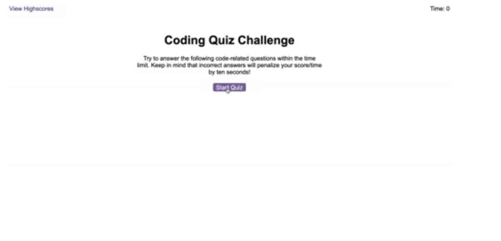
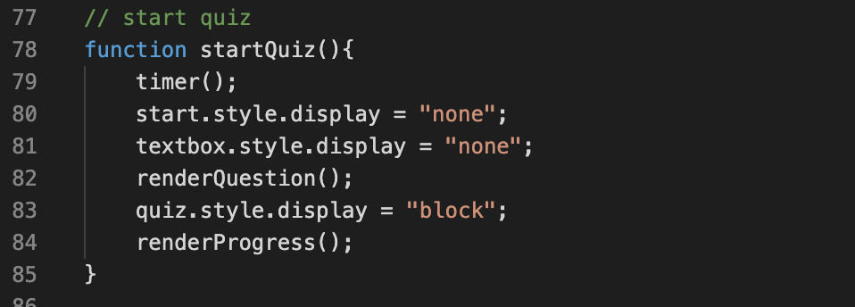
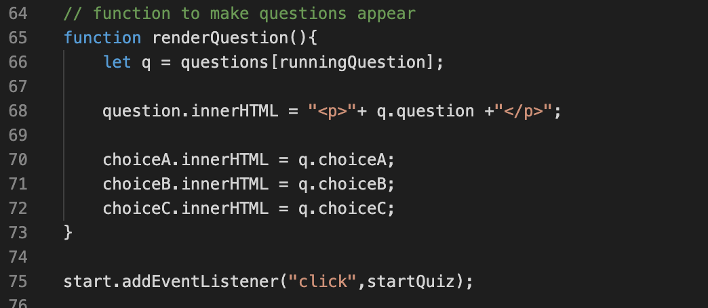

# Code-Quiz

The purpous of this app is to use HTML, CSS and Javascript to create a dinamicly functioning quiz that moved between the quiz questions, which were being timed, and a high scores page. 



## Table of Content
- Objective
- Deploy Link
- Getting Started
- Code Highlights
- Technology
- Author 

## Objective 
Build a timed quiz that keeps socre as the user answers five different questions, after completion the user will be prompted to fill out their initals on a highscores page that will save to local storage and be shown next time the quiz is played!

## Deploy Link

* [See Live Site](https://ayladillis.github.io/code-quiz/)

## Getting Started
These instructions will get you a copy of the project up and running on your local machine for development and testing purposes. See deployment for notes on how to deploy the project on a live system.

```
$ git clone git@github.com:ayladillis/code-quiz.git
ayladillis/code-quiz.git
$ cd ayladillis/code-quiz.git
```
Then open in your preferred text editor:
- [vim](https://www.vim.org/) 
- [emmacs](https://www.gnu.org/software/emacs/)
- [visual studio code](https://code.visualstudio.com/) 

## Code Highlight
Inorder to move between the questions I used style.display to either set the containers to 'block' or 'none' when the user clicked on a button


I added an event listener to the rendered questions function so whichever answer was clicked the code quiz would move forward and render the next question


## Technology
* [HTML](https://developer.mozilla.org/en-US/docs/Web/HTML)
* [CSS](https://developer.mozilla.org/en-US/docs/Web/CSS)
* [Javascript](https://developer.mozilla.org/en-US/docs/Web/JavaScrip)

## Authors

- [Ayla Dills](https://github.com/ayladillis)


